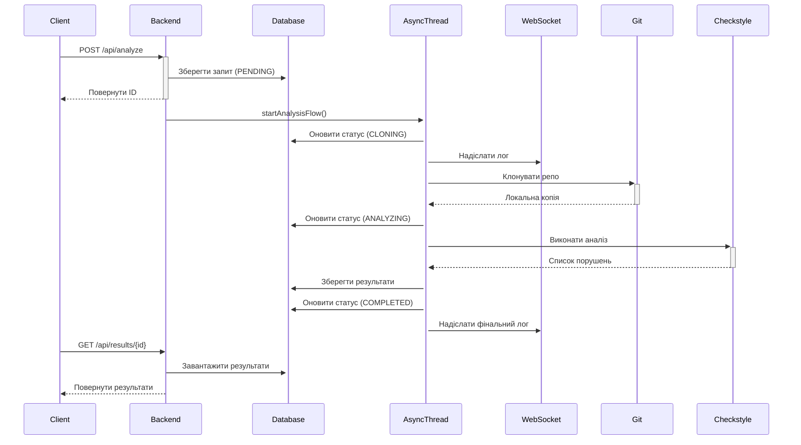

# 🔍 Checkstyle Analyzer - Backend

> Потужний бекенд-сервіс для автоматизованого аналізу якості Java коду за допомогою Checkstyle

[](https://www.oracle.com/java/)
[](https://spring.io/projects/spring-boot)
[](https://maven.apache.org/)
[](LICENSE)

## 📋 Зміст

- [Про проект](#-про-проект)
- [Основні можливості](#-основні-можливості)
- [Технологічний стек](#️-технологічний-стек)
- [Швидкий старт](#-швидкий-старт)
- [Конфігурація](#️-конфігурація)
- [API документація](#-api-документація)
- [WebSocket](#-websocket)
- [Структура проєкт](#-структура-проекту)
- [Тестування](#-тестування)
- [База даних](#️-база-даних)
- [Розв'язаних проблеми](#-вирішені-проблеми)
- [Внесок у проект](#-внесок-у-проект)

## 🎯 Про проект

**Checkstyle Analyzer** — це backend сервіс, який автоматизує процес перевірки якості Java коду. Він клонує Git
репозиторії, виконує аналіз Checkstyle та зберігає результати в базі даних з підтримкою real-time логування через
WebSocket.

### Основні переваги

- ✅ Асинхронна обробка запитів
- ✅ Real-time логування через WebSocket
- ✅ Гнучка система конфігурації Checkstyle
- ✅ Підтримка кастомних правил
- ✅ Збереження історії аналізів
- ✅ REST API для інтеграції

## 🚀 Основні можливості

### Аналіз коду

- Автоматичне клонування Git репозиторіїв (shallow clone)
- Пошук усіх `.java` файлів у проєкт
- Запуск Checkstyle аналізу з конфігурованими правилами
- Збереження результатів з деталями про порушення

### Управління конфігурацією

- Створення та збереження профілів Checkstyle
- Підтримка структурованих правил (DTO) та raw XML
- Можливість оновлення активної конфігурації
- Експорт/імпорт конфігурацій

### Real-time моніторинг

- WebSocket підключення для live логів
- Статуси: `PENDING`, `CLONING`, `ANALYZING`, `COMPLETED`, `FAILED`
- Детальна інформація про помилки

## 🛠️ Технологічний стек

### Backend Framework

- **Java 17** - мова програмування
- **Spring Boot 3.2.12** - основний фреймворк
- **Spring Data JPA** - робота з базою даних
- **Spring WebSocket (STOMP)** - real-time комунікація

### Бібліотеки та інструменти

- **Checkstyle 12.1.1** — статичний аналіз коду
- **JGit** - робота з Git репозиторіями
- **Hibernate** - ORM для JPA
- **Maven** — система збірки проєкт

### Бази даних

- **MySQL** - production база даних
- **H2** — розробка та тестування

### Тестування

- **JUnit 5** - unit тестування
- **Mockito** - мокування залежностей
- **Spring Boot Test—**integration тести

## ⚡ Швидкий старт

### Передумови

Переконайтеся, що у вас установлено:

- ☕ Java 17 або новіша версія
- 📦 Maven 3.6+
- 🗄️ MySQL 8.0+ (або використовуйте H2)

### Встановлення

1. **Клонуйте репозиторій**

```bash
git clone https://github.com/yourusername/JavaCheckstyleHub.git
cd JavaCheckstyleHub
```

2. **Налаштуйте базу даних**

Створіть файл `src/main/resources/application.properties` на основі `application.properties.example`:

```bash
cp src/main/resources/application.properties.example src/main/resources/application.properties
```

Відредагуйте параметри підключення:

```properties
spring.datasource.url=jdbc:mysql://localhost:3306/checkstyle_hub
spring.datasource.username=root
spring.datasource.password=your_password
```

3. **Створіть базу даних MySQL**

```sql
CREATE
DATABASE checkstyle_hub CHARACTER SET utf8mb4 COLLATE utf8mb4_unicode_ci;
GRANT ALL PRIVILEGES ON checkstyle_hub.* TO
'root'@'localhost';
FLUSH
PRIVILEGES;
```

4. **Зберіть проєкт**

```bash
mvn clean package -DskipTests
```

5. **Запустіть додаток**

```bash
mvn spring-boot:run
```

Сервер запуститься на `http://localhost:8000` 🎉

### Альтернативно: використання H2 (для розробки)

Замініть конфігурацію БД у `application.properties`:

```properties
spring.datasource.url=jdbc:h2:mem:checkstyle_hub;DB_CLOSE_DELAY=-1
spring.datasource.username=sa
spring.datasource.password=
spring.datasource.driver-class-name=org.h2.Driver
spring.h2.console.enabled=true
spring.h2.console.path=/h2-console
```

Доступ до H2 Console: `http://localhost:8000/h2-console`

## ⚙️ Конфігурація

### Основні параметри

#### application.properties

```properties
# Порт сервера
server.port=8000
# MySQL конфігурація
spring.datasource.url=jdbc:mysql://localhost:3306/checkstyle_hub
spring.datasource.username=root
spring.datasource.password=
# JPA/Hibernate
spring.jpa.hibernate.ddl-auto=update
spring.jpa.show-sql=false
spring.jpa.properties.hibernate.connection.autocommit=true
```

### Thread Pool налаштування

Налаштовано в `AsyncConfig.java`:

- **Core threads**: 2
- **Max threads**: 5
- **Queue capacity**: 100

### Checkstyle конфігурація

Дефолтна конфігурація знаходиться у `src/main/resources/default_checkstyle_rules.xml` та базується на Google Java Style
Guide.

## 📡 API документація

### Аналіз репозиторію

#### POST `/api/analyze`

Запускає аналіз Git репозиторію.

**Request:**

```json
{
  "repoUrl": "https://github.com/username/repository",
  "checkstyleConfig": "<optional custom XML config>"
}
```

**Response:**

```json
1
```

Повертає ID запиту.

**Приклад curl:**

```bash
curl -X POST http://localhost:8000/api/analyze \
  -H "Content-Type: application/json" \
  -d '{"repoUrl":"https://github.com/iluwatar/java-design-patterns"}'
```

---

#### GET `/api/status/{id}`

Отримує поточний статус аналізу.

**Response:**

```json
{
  "id": 1,
  "status": "COMPLETED",
  "errorMessage": null,
  "createdAt": "2025-11-18T00:29:53.912808"
}
```

**Можливі статуси:**

| Статус      | Опис                         |
|-------------|------------------------------|
| `PENDING`   | Запит у черзі                |
| `CLONING`   | Клонування репозиторію       |
| `ANALYZING` | Виконання Checkstyle аналізу |
| `COMPLETED` | Аналіз завершено успішно     |
| `FAILED`    | Сталася помилка              |

---

#### GET `/api/results/{id}`

Отримує результати аналізу.

**Response:**

```json
[
  {
    "id": 1,
    "filePath": "src/main/java/Example.java",
    "lineNumber": 31,
    "severity": "warning",
    "message": "Variable 'SIMPLE' must be private and have accessor methods."
  }
]
```

---

### Управління конфігурацією Checkstyle

#### GET `/api/checkstyle/configuration`

Отримує активну конфігурацію як структуровані правила.

#### PATCH `/api/checkstyle/configuration`

Оновлює окремі поля активної конфігурації.

#### PUT `/api/checkstyle/configuration`

Повністю замінює активну конфігурацію.

#### POST `/api/checkstyle/configuration/reset`

Скидає конфігурацію до дефолтних значень.

## 🔌 WebSocket

### Підключення

**Endpoint:** `/ws-analyzer`

**Підписка:** `/topic/logs/{requestId}`

### Приклад використання (JavaScript)

```javascript
import SockJS from 'sockjs-client';
import {Stomp} from '@stomp/stompjs';

const socket = new SockJS('http://localhost:8000/ws-analyzer');
const stompClient = Stomp.over(socket);

stompClient.connect({}, () => {
    console.log('WebSocket підключено');

    stompClient.subscribe(`/topic/logs/${requestId}`, (message) => {
        const log = JSON.parse(message.body);
        console.log(`[${log.level}] ${log.message}`);
    });
});
```

### Приклад логів

```
[INFO] Починаю клонування...
[INFO] Клонування завершено. Шукаю Java файли...
[INFO] Знайдено 156 Java файлів. Запускаю аналіз...
[INFO] Збереження 342 результатів...
[INFO] Результати успішно збережено в базу даних.
[INFO] Аналіз завершено. Знайдено 342 порушень.
```

## 📁 Структура проєкт

```
JavaCheckstyleHub/
├── src/
│   ├── main/
│   │   ├── java/com/checkstylehub/analyzer/
│   │   │   ├── config/                    # Конфігурація Spring
│   │   │   │   ├── AsyncConfig.java       # Thread pool
│   │   │   │   └── WebSocketConfig.java   # WebSocket STOMP
│   │   │   ├── controller/                # REST контролери
│   │   │   │   ├── AnalysisController.java
│   │   │   │   ├── CheckstyleConfigurationController.java
│   │   │   │   └── LogWebsocketController.java
│   │   │   ├── dto/                       # Data Transfer Objects
│   │   │   │   ├── AnalysisRequestDto.java
│   │   │   │   ├── AnalysisResultDto.java
│   │   │   │   ├── AnalysisRequestStatusDto.java
│   │   │   │   ├── CheckstyleRulesDto.java
│   │   │   │   └── ...
│   │   │   ├── entity/                    # JPA entities
│   │   │   │   ├── AnalysisRequest.java
│   │   │   │   ├── AnalysisResult.java
│   │   │   │   ├── AnalysisLog.java
│   │   │   │   └── CheckstyleConfiguration.java
│   │   │   ├── repository/                # Spring Data JPA
│   │   │   │   ├── AnalysisRequestRepository.java
│   │   │   │   ├── AnalysisResultRepository.java
│   │   │   │   └── ...
│   │   │   ├── service/                   # Бізнес-логіка
│   │   │   │   ├── AnalysisService.java
│   │   │   │   ├── GitService.java
│   │   │   │   ├── CheckstyleService.java
│   │   │   │   ├── CheckstyleConfigurationService.java
│   │   │   │   └── CheckstyleXmlConverter.java
│   │   │   ├── exception/                 # Кастомні винятки
│   │   │   │   └── RepositoryAccessException.java
│   │   │   └── AnalyzerApplication.java   # Main клас
│   │   └── resources/
│   │       ├── application.properties.example
│   │       └── default_checkstyle_rules.xml
│   └── test/
│       └── java/com/checkstylehub/analyzer/
│           ├── controller/
│           ├── service/
│           ├── repository/
│           └── AnalyzerApplicationTest.java
├── pom.xml
├── README.md
└── .gitignore
```

## 🧪 Тестування

### Запуск тестів

```bash
# Усі тести
mvn test

# Конкретний клас
mvn test -Dtest=GitServiceTest

# Конкретний тест
mvn test -Dtest=GitServiceTest#testClonePublicRepository

# З детальним виводом
mvn test -X
```

### Тестове покриття

| Тестовий клас                        | Тестів | Опис                                                       |
|--------------------------------------|--------|------------------------------------------------------------|
| `GitServiceTest`                     | 4      | Клонування репозиторіїв, робота з тимчасовими директоріями |
| `CheckstyleServiceTest`              | 6      | Пошук Java файлів, запуск Checkstyle аналізу               |
| `AnalysisControllerTest`             | 9      | REST API endpoints, валідація запитів                      |
| `CheckstyleConfigurationServiceTest` | 8      | Управління конфігураціями                                  |
| `CheckstyleXmlConverterTest`         | 7      | Конвертація XML ↔ DTO                                      |
| `AnalysisRequestRepositoryTest`      | 6      | CRUD операції з БД                                         |
| `AnalyzerApplicationTest`            | 1      | Завантаження Spring контексту                              |

**Загалом: 41 тест** ✅

### Приклад тестового виводу

```
[INFO] Tests run: 41, Failures: 0, Errors: 0, Skipped: 0
[INFO] BUILD SUCCESS
```

## 🗄️ База даних

### Схема БД

#### Таблиця `analysis_requests`

Зберігає запити на аналіз.

| Поле            | Тип          | Опис                              |
|-----------------|--------------|-----------------------------------|
| `id`            | BIGINT       | Primary key                       |
| `repo_url`      | VARCHAR(255) | URL репозиторію                   |
| `status`        | VARCHAR(255) | Поточний статус                   |
| `error_message` | TEXT         | Повідомлення про помилку (якщо є) |
| `created_at`    | TIMESTAMP    | Час створення                     |

#### Таблиця `analysis_results`

Зберігає знайдені порушення Checkstyle.

| Поле          | Тип          | Опис                              |
|---------------|--------------|-----------------------------------|
| `id`          | BIGINT       | Primary key                       |
| `request_id`  | BIGINT       | Foreign key → `analysis_requests` |
| `file_path`   | VARCHAR(255) | Відносний шлях до файлу           |
| `line_number` | INT          | Номер рядка                       |
| `severity`    | VARCHAR(255) | Рівень серйозності                |
| `message`     | TEXT         | Опис порушення                    |

#### Таблиця `analysis_logs`

Зберігає логи процесу аналізу.

| Поле         | Тип         | Опис                              |
|--------------|-------------|-----------------------------------|
| `id`         | BIGINT      | Primary key                       |
| `request_id` | BIGINT      | Foreign key → `analysis_requests` |
| `level`      | VARCHAR(16) | INFO/ERROR                        |
| `message`    | TEXT        | Текст логу                        |
| `timestamp`  | TIMESTAMP   | Час створення                     |

#### Таблиця `checkstyle_configuration`

Зберігає конфігурації Checkstyle.

| Поле          | Тип          | Опис                           |
|---------------|--------------|--------------------------------|
| `id`          | BIGINT       | Primary key                    |
| `config_name` | VARCHAR(255) | Назва конфігурації (унікальна) |
| `xml_content` | TEXT         | XML конфігурація               |
| `is_active`   | BOOLEAN      | Чи активна конфігурація        |
| `created_at`  | TIMESTAMP    | Час створення                  |
| `updated_at`  | TIMESTAMP    | Час оновлення                  |

### Перегляд даних

#### MySQL (phpMyAdmin)

1. Відкрийте `http://localhost/phpmyadmin`
2. Виберіть базу `checkstyle_hub`
3. Переглядайте таблиці

#### H2 Console

1. Відкрийте `http://localhost:8000/h2-console`
2. JDBC URL: `jdbc:h2:mem:checkstyle_hub`
3. Username: `sa`, Password: (порожньо)

## 🐛 Вирішені проблеми

### Проблема: Результати не зберігаються при повторному аналізі

**Симптоми:**

- Перший аналіз працює коректно
- Наступні аналізи не зберігають результати в БД

**Причина:**
`AnalysisRequest` entity від'єднувався від persistence context під час довготривалої транзакції.

**Рішення:**

```java
// Повернення entity в managed state
request = entityManager.

merge(request);

// Явний flush після збереження
entityManager.

flush();
```

### Проблема: Connection is read-only

**Причина:**
Transaction була помічена як `readOnly = true` для методів, які виконують запис.

**Рішення:**
Видалено `readOnly = true` та додано параметри автокоміту:

```properties
spring.jpa.properties.hibernate.connection.autocommit=true
spring.datasource.hikari.auto-commit=true
```

## 🔍 Як це працює

### Процес аналізу



## 🤝 Внесок у проект

Ми вітаємо внески! Будь ласка, дотримуйтеся цих кроків:

1. **Fork** репозиторію
2. Створіть **feature branch**
   ```bash
   git checkout -b feature/amazing-feature
   ```
3. **Commit** ваші зміни
   ```bash
   git commit -m 'Add some amazing feature'
   ```
4. **Push** в branch
   ```bash
   git push origin feature/amazing-feature
   ```
5. Відкрийте **Pull Request**

### Правила коду

- ✅ Використовуйте Java 17 features
- ✅ Дотримуйтесь Google Java Style Guide
- ✅ Додавайте unit тести для нового коду
- ✅ Коментарі англійською, логи українською
- ✅ Документуйте публічні методи JavaDoc

## 📝 Ліцензія

Цей проект створено для навчальних цілей у рамках курсової роботи.

## 👥 Автори

**CheckstyleHub Team**
